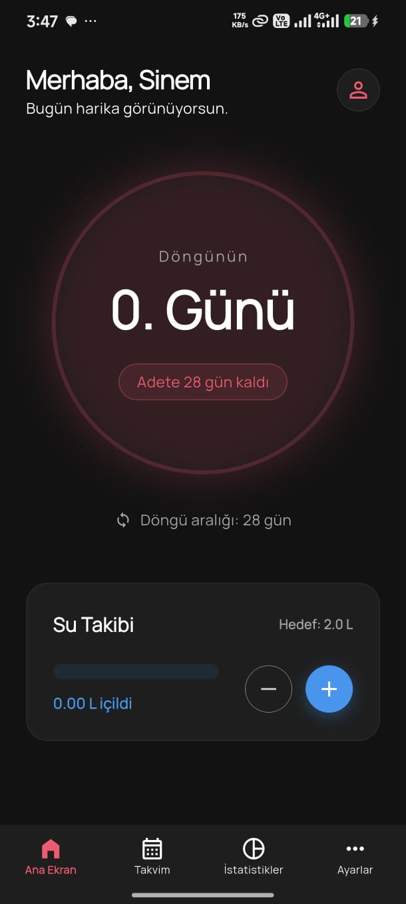
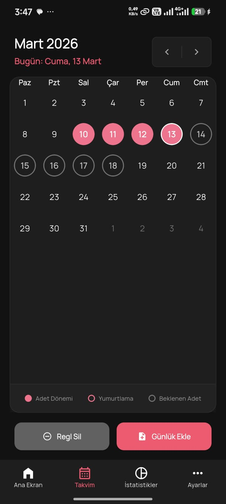
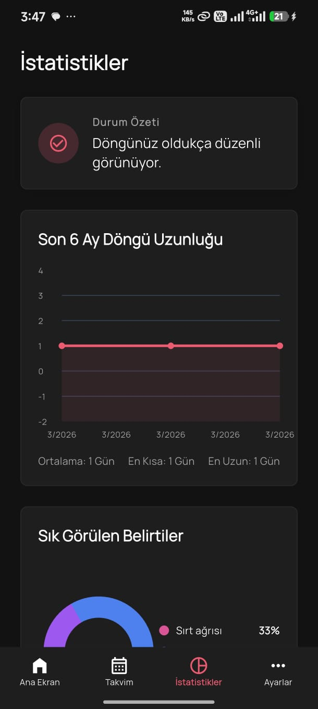
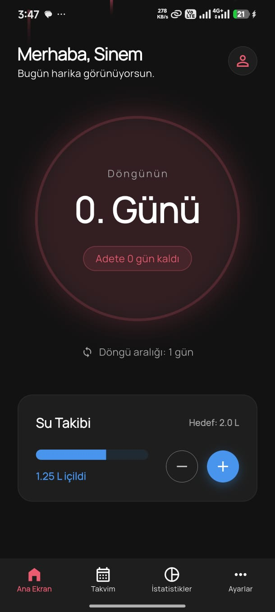
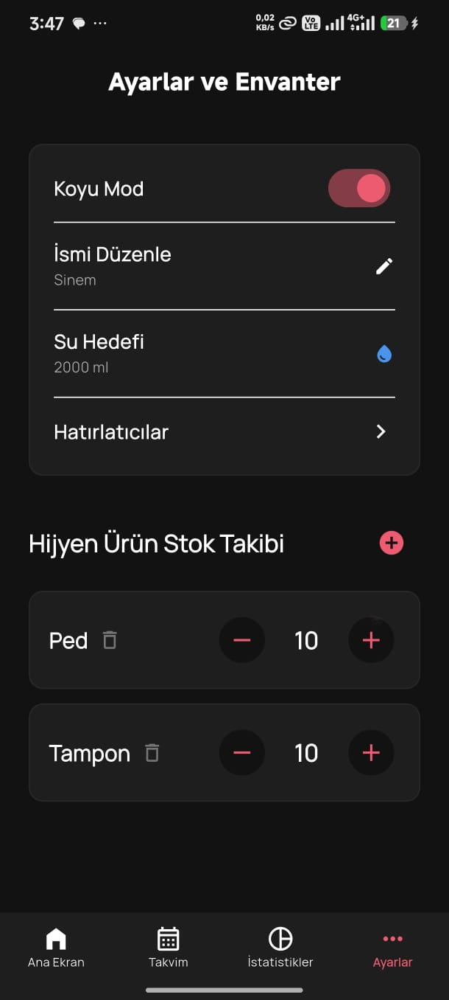
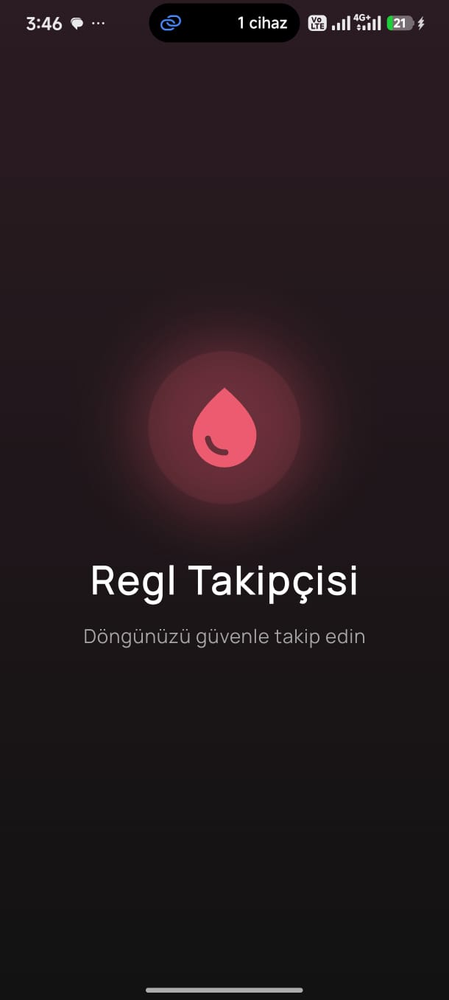
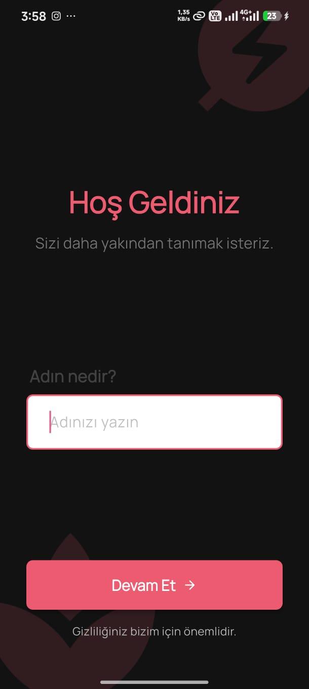

# 🩸 Regl Takipçisi — Period Tracker

Gizliliğe öncelik veren, tamamen çevrimdışı çalışan ve Türkçe arayüze sahip kapsamlı bir regl döngüsü takip uygulaması.

> Tüm veriler cihazda kalır. İnternet bağlantısı veya hesap oluşturma gerektirmez.

---

## 📸 Ekran Görüntüleri


| Ana Ekran | Takvim | Günlük |
|:---------:|:------:|:------:|
|  |  |  |

| İstatistikler | Ana Sayfa 2 | Ayarlar |
|:-------------:|:--------------:|:-------:|
|  |  |  |

| Açılış Ekranı | Karşılama |
|:-------------:|:---------:|
|  |  |


---

## ✨ Özellikler

### 🔴 Regl Döngü Takibi
- Takvim üzerinden **her günü tek tek** regl günü olarak işaretleme/kaldırma
- Sabit 5 gün varsayımı yok — tam kontrol kullanıcıda
- Aynı ay içinde çakışan kayıt oluşmasını otomatik önleme (±15 gün penceresi)
- Sonraki adet ve yumurtlama tarihini tahmin etme
- Ortalama döngü uzunluğunu otomatik hesaplama

### 📓 Günlük (Daily Log)
- Takvimden **herhangi bir geçmiş güne** günlük ekleme/düzenleme
- **Çoklu duygu durumu** seçimi (örn: hem üzgün hem uykusuz)
- **Çoklu fiziksel belirti** seçimi (17 farklı belirti)
- Serbest metin not alanı (Türkçe karakter desteği, UTF-8)
- Kaydedilen günlükleri takvimde gün bazlı görüntüleme
- Günlük silme özelliği

### 💧 Su Takibi
- Günlük su tüketimini litre bazında takip etme
- Ayarlardan hedef belirleme
- Artırma ve azaltma kontrolleri
- Ana ekranda görsel gösterge

### 📊 İstatistikler
- Gerçek verilerden hesaplanan döngü istatistikleri
- Ortalama döngü uzunluğu, toplam kayıtlı döngü sayısı
- Grafik ve pasta diyagramları (fl_chart)

### 🔔 Hatırlatıcılar
- Belirli tarih ve saate hatırlatıcı kurma
- Tekrar seçenekleri: Tek seferlik, Günlük, Haftalık, Aylık
- Yerel bildirimlerle çalışır (internet gerekmez)
- Hatırlatıcı eklendikten sonra listeye anında yansıma

### 🧴 Hijyen Ürün Stok Takibi
- Özel ürün ekleme (yalnızca kullanılanları takip etme)
- Stok artırma/azaltma
- Ürün açma/kapama

### 🏥 Sağlık Köşesi
- Regl dönemiyle ilgili bilgilendirici blog yazıları
- Kategorilere ayrılmış içerikler (ağrı yönetimi, beslenme, egzersiz, psikoloji, uyku)

### ⚙️ Ayarlar
- Koyu/Açık tema geçişi
- İsim düzenleme
- Su hedefi ayarlama
- Hijyen ürün yönetimi

### 🎨 Görsel ve UX
- Modern, premium tasarım
- Koyu ve açık tema desteği
- Türkçe arayüz ve Türkçe takvim
- Splash (açılış) ekranı
- İlk kullanımda onboarding akışı (isim girişi)
- Gelecek tarihlere kayıt girme engeli

---

## 🏗️ Proje Mimarisi

```
lib/
├── main.dart                        # Uygulama giriş noktası
├── constants/
│   ├── app_colors.dart              # Renk paleti (aydınlık/koyu tema)
│   └── app_strings.dart             # Türkçe sabit metinler
├── database/
│   └── db_helper.dart               # SQLite veritabanı (sqflite) yönetimi
├── models/
│   ├── cycle.dart                   # Regl döngüsü modeli
│   ├── daily_log.dart               # Günlük kayıt modeli (çoklu duygu/belirti)
│   ├── reminder.dart                # Hatırlatıcı modeli
│   ├── inventory_item.dart          # Hijyen ürün modeli
│   ├── blog_post.dart               # Blog yazısı modeli
│   ├── user.dart                    # Kullanıcı modeli
│   └── water_intake.dart            # Su tüketimi modeli
├── providers/
│   ├── app_provider.dart            # Tema, kullanıcı adı, su hedefi
│   └── cycle_provider.dart          # Döngü, günlük, su takibi veri yönetimi
├── screens/
│   ├── splash_screen.dart           # Açılış ekranı (animasyonlu)
│   ├── onboarding_screen.dart       # İlk kullanım: isim girişi
│   ├── dashboard_screen.dart        # Ana ekran + alt navigasyon çubuğu
│   ├── calendar_screen.dart         # Takvim + regl işaretleme + günlük görünümü
│   ├── daily_log_screen.dart        # Günlük ekleme/düzenleme formu
│   ├── statistics_screen.dart       # İstatistik grafikleri
│   ├── reminders_screen.dart        # Hatırlatıcı yönetimi
│   ├── health_corner_screen.dart    # Sağlık blog yazıları
│   └── settings_inventory_screen.dart # Ayarlar + hijyen ürün stok takibi
├── services/
│   └── notification_service.dart    # Yerel bildirim servisi
└── utils/
    └── app_theme.dart               # Tema tanımları (açık/koyu)
```

### Mimari Desen

| Katman | Teknoloji | Açıklama |
|--------|-----------|----------|
| **State Management** | Provider (ChangeNotifier) | `AppProvider` ve `CycleProvider` ile reaktif durum yönetimi |
| **Veritabanı** | sqflite (SQLite) | Çevrimdışı, cihazda saklanan ilişkisel veritabanı |
| **Bildirimler** | flutter_local_notifications + workmanager | Arka plan bildirimleri ve tekrarlayan hatırlatıcılar |
| **Grafik** | fl_chart | İstatistik dashboard'unda pasta ve çubuk grafikleri |
| **Takvim** | table_calendar | Türkçe lokalize, özelleştirilebilir takvim görünümü |
| **Tema** | Material 3 | Koyu/açık tema, Google Fonts entegrasyonu |

---

## 🗄️ Veritabanı Şeması

```sql
-- Kullanıcı bilgileri
CREATE TABLE users (
  id INTEGER PRIMARY KEY AUTOINCREMENT,
  name TEXT NOT NULL,
  dark_mode INTEGER NOT NULL
);

-- Regl döngüleri
CREATE TABLE cycles (
  id INTEGER PRIMARY KEY AUTOINCREMENT,
  start_date TEXT NOT NULL,
  end_date TEXT
);

-- Günlük kayıtlar
CREATE TABLE daily_logs (
  id INTEGER PRIMARY KEY AUTOINCREMENT,
  date TEXT NOT NULL UNIQUE,
  mood_type TEXT NOT NULL,          -- JSON dizisi: ["Üzgün", "Uykusuz"]
  physical_symptoms TEXT NOT NULL,  -- JSON dizisi: ["Kramp", "Baş Ağrısı"]
  notes TEXT NOT NULL
);

-- Su tüketimi
CREATE TABLE water_intake (
  id INTEGER PRIMARY KEY AUTOINCREMENT,
  date TEXT NOT NULL UNIQUE,
  amount INTEGER NOT NULL
);

-- Hijyen ürün envanteri
CREATE TABLE inventory (
  id INTEGER PRIMARY KEY AUTOINCREMENT,
  item_type TEXT NOT NULL UNIQUE,
  current_stock INTEGER NOT NULL
);

-- Hatırlatıcılar
CREATE TABLE reminders (
  id INTEGER PRIMARY KEY AUTOINCREMENT,
  text TEXT NOT NULL,
  trigger_time TEXT NOT NULL,
  is_active INTEGER NOT NULL DEFAULT 1,
  recurrence_type TEXT NOT NULL DEFAULT 'none'  -- none, daily, weekly, monthly
);

-- Blog yazıları
CREATE TABLE blog_posts (
  id INTEGER PRIMARY KEY AUTOINCREMENT,
  title TEXT NOT NULL,
  category TEXT NOT NULL,
  read_time INTEGER NOT NULL,
  image_url TEXT NOT NULL,
  content TEXT NOT NULL
);
```

---

## 🚀 Kurulum ve Çalıştırma

### Gereksinimler
- Flutter SDK `^3.11.0`
- Dart SDK `^3.11.0`
- Android Studio / VS Code
- Android Emulator veya fiziksel cihaz

### Adımlar

```bash
# 1. Projeyi klonlayın
git clone <repo-url>
cd first_app

# 2. Bağımlılıkları yükleyin
flutter pub get

# 3. Uygulamayı çalıştırın
flutter run

# 4. (Opsiyonel) Analiz yapın
flutter analyze

# 5. (Opsiyonel) Release build
flutter build apk --release
```

---

## 📦 Bağımlılıklar

| Paket | Versiyon | Kullanım |
|-------|----------|----------|
| `provider` | ^6.1.5+1 | Durum yönetimi (state management) |
| `sqflite` | ^2.4.2 | SQLite veritabanı |
| `table_calendar` | ^3.2.0 | Takvim görünümü |
| `fl_chart` | ^1.1.1 | Grafik ve diyagramlar |
| `flutter_local_notifications` | ^21.0.0 | Yerel bildirimler |
| `workmanager` | ^0.9.0+3 | Arka plan görevleri |
| `intl` | ^0.20.2 | Tarih/saat formatlama ve lokalizasyon |
| `shared_preferences` | ^2.5.4 | Basit anahtar-değer saklama |
| `google_fonts` | ^8.0.2 | Tipografi |
| `path_provider` | ^2.1.5 | Dosya yolu çözümleme |
| `timezone` | ^0.11.0 | Zaman dilimi desteği |

---

## 🔐 Gizlilik

Bu uygulama **tamamen çevrimdışı** çalışır:
- ❌ Sunucuya veri gönderimi yok
- ❌ Hesap oluşturma veya giriş yapma yok
- ❌ Analitik veya izleme yok
- ✅ Tüm veriler yalnızca cihazda SQLite veritabanında saklanır
- ✅ Uygulama silindiğinde tüm veriler silinir

---

## 📱 Desteklenen Platformlar

| Platform | Durum |
|----------|-------|
| Android | ✅ Destekleniyor |
| iOS | ⚠️ Test edilmedi (Flutter ile uyumlu olmalı) |
| Web | ❌ Desteklenmiyor (sqflite nedeniyle) |

---

## 🛠️ Geliştirme Notları

### Kod Standartları
- Tüm `withOpacity` çağrıları modern `withValues(alpha: ...)` ile değiştirildi
- Deprecate edilmiş API'ler temizlendi
- Türkçe karakter desteği (UTF-8) tüm metin alanlarında aktif
- UPSERT mantığı ile çakışan kayıtlar önlendi

### Navigasyon Yapısı
```
SplashScreen
  └── OnboardingScreen (ilk kullanım)
        └── DashboardScreen
              ├── [Tab 0] Ana Ekran (_HomeTab)
              ├── [Tab 1] Takvim (CalendarScreen)
              │     └── [Push] Günlük Ekle/Düzenle (DailyLogScreen)
              ├── [Tab 2] İstatistikler (StatisticsScreen)
              └── [Tab 3] Ayarlar (SettingsInventoryScreen)
                    └── Hatırlatıcılar (RemindersScreen)
                    └── Sağlık Köşesi (HealthCornerScreen)
```

---

## 📄 Lisans

Bu proje özel kullanım amaçlıdır.

---

<p align="center">
  Flutter 💙 ile geliştirildi
</p>
